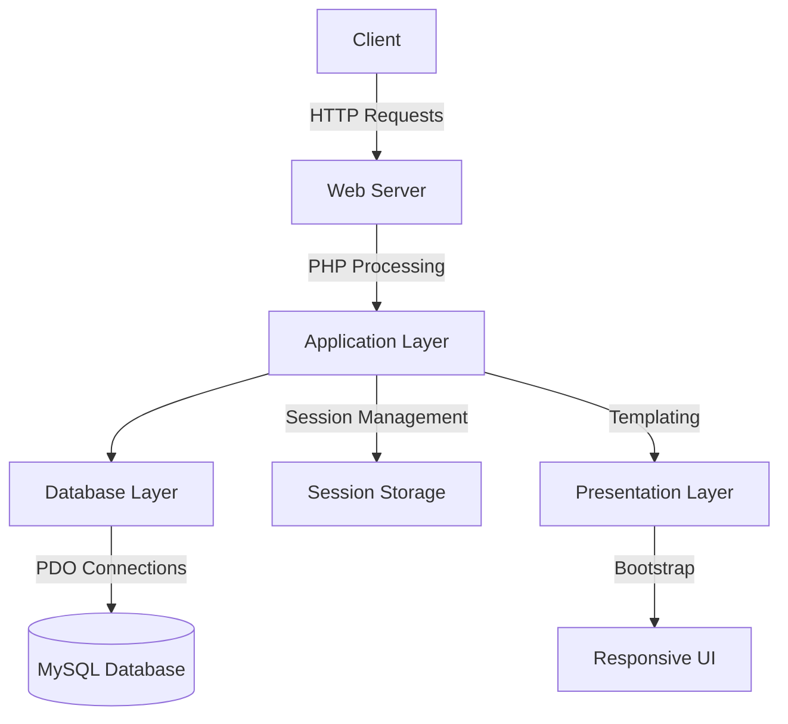

# Learning Academy Task Management System

 

A full-stack web application for academic project management, implementing secure user authentication, role-based access control, and collaborative task management features.

## 📑 Table of Contents
- [Project Overview](#-project-overview)
- [Features](#-features)
- [Learning Outcomes](#-learning-outcomes)
- [System Architecture](#-system-architecture)
- [Installation Guide](#-installation-guide)
- [Technology Stack](#-technology-stack)
- [Deployment](#-deployment)
- [Contributing](#-contributing)
- [License](#-license)

## 🌟 Project Overview

A comprehensive solution for student teams to manage academic projects, featuring:

- **User Roles**: 
  - Admin: Full CRUD operations, user management
  - Team Member: Task creation and self-assignment
- **Core Functionalities**:
  - Secure registration/login system
  - Task assignment with ownership tracking
  - Responsive dashboard with real-time updates
  - Session-based authentication
  - Environment-based configuration

## 🛠 Features

| Feature | Description | Tech Used |
|---------|-------------|-----------|
| Authentication System | Secure user registration/login with password hashing | PHP, MySQL, Sessions |
| Role-Based Access | Different privileges for admins and team members | PHP, Session Management |
| Task Management | Create, read, update, and delete operations for tasks | PHP, PDO, MySQL |
| Responsive UI | Mobile-friendly interface with interactive elements | Bootstrap 5, Font Awesome |
| Error Handling | Custom error pages and validation messages | PHP, Bootstrap |
| Security | SQL injection prevention, XSS protection | PDO Prepared Statements, htmlspecialchars |

## 🎓 Learning Outcomes

### Core Competencies Developed
- **Backend Development**:
  - PHP server-side scripting
  - MySQL database design (ER diagram implementation)
  - RESTful routing principles
  - PDO database interactions
- **Security Practices**:
  - bcrypt password hashing
  - Session hijacking prevention
  - SQL injection mitigation
  - Cross-site scripting (XSS) protection
- **Frontend Integration**:
  - Bootstrap grid system implementation
  - Responsive design techniques
  - DOM manipulation with PHP templating
- **DevOps Skills**:
  - Environment configuration management
  - Cross-platform deployment strategies
  - Version control best practices

## 🏗 System Architecture



## 📥 Installation Guide

### Prerequisites

| Software | Version | Installation Guide |
|----------|---------|--------------------|
| PHP      | 7.4+    | [php.net](https://www.php.net/manual/en/install.php) |
| MySQL    | 5.7+    | [mysql.com](https://dev.mysql.com/doc/mysql-installation-excerpt/5.7/en/) |
| Composer | 2.0+    | [getcomposer.org](https://getcomposer.org/download/) |
| Web Server | -     | Apache/Nginx or PHP built-in server |

### Local Development Setup

1. **Clone Repository**
   ```bash
   git clone https://github.com/yourusername/learning-academy-task-manager.git
   cd learning-academy-task-manager
   ```

2. **Install Dependencies**
   ```bash
   composer install
   ```

3. **Database Setup**
   ```sql
   CREATE DATABASE task_manager;
   USE task_manager;
   
   CREATE TABLE users (
       id INT PRIMARY KEY AUTO_INCREMENT,
       name VARCHAR(50) NOT NULL,
       email VARCHAR(50) UNIQUE NOT NULL,
       password VARCHAR(255) NOT NULL,
       role ENUM('admin', 'team member') NOT NULL,
       job_role VARCHAR(50) NOT NULL,
       created_at DATETIME DEFAULT CURRENT_TIMESTAMP
   );
   
   CREATE TABLE tasks (
       id INT PRIMARY KEY AUTO_INCREMENT,
       task_name VARCHAR(100) NOT NULL,
       description TEXT,
       created_at DATETIME DEFAULT CURRENT_TIMESTAMP,
       assigned_to INT NOT NULL,
       assigned_by INT NOT NULL,
       FOREIGN KEY (assigned_to) REFERENCES users(id),
       FOREIGN KEY (assigned_by) REFERENCES users(id)
   );
   ```

4. **Environment Configuration**
   ```bash
   cp .env.example .env
   ```
   Edit `.env` file:
   ```ini
   APP_ENV=local
   APP_DEBUG=true
   DB_HOST=localhost
   DB_NAME=task_manager
   DB_USER=root
   DB_PASS=
   ```

5. **Start Development Server**
   ```bash
   php -S localhost:8000
   ```

## 🖥 Technology Stack

### Core Technologies

| Technology | Role | Version | Documentation |
|------------|------|---------|---------------|
|  | Server-side logic | 7.4+ | [PHP Docs](https://www.php.net/docs.php) |
|  | Data persistence | 5.7+ | [MySQL Docs](https://dev.mysql.com/doc/) |
|  | Responsive UI | 5.3+ | [Bootstrap Docs](https://getbootstrap.com/docs/5.3/getting-started/introduction/) |

### Key Dependencies

| Package | Purpose | Version |
|---------|---------|---------|
| [vlucas/phpdotenv](https://github.com/vlucas/phpdotenv) | Environment variables | ^5.5 |
| [PDO](https://www.php.net/manual/en/book.pdo.php) | Database abstraction | Built-in |
| [Font Awesome](https://fontawesome.com/) | Icon system | 6.4+ |

## 🚀 Deployment

### InfinityFree Hosting

1. **Database Configuration**
   - Use provided MySQL credentials from control panel
   - Update `.env` with production values:
     ```ini
     APP_ENV=production
     APP_DEBUG=false
     DB_HOST=sqlXXX.epizy.com
     DB_NAME=epiz_XXXXXX_dbname
     DB_USER=epiz_XXXXXX_user
     DB_PASS=your_password
     ```

2. **File Upload**
   ```bash
   rsync -avz --exclude='.env' --exclude='.git' ./ user@server:/path/to/public_html
   ```

3. **Set Permissions**
   ```bash
   chmod 755 public_html
   chmod 644 public_html/.htaccess
   ```

## 🤝 Contributing

1. Fork the repository
2. Create feature branch (`git checkout -b feature/amazing-feature`)
3. Commit changes (`git commit -m 'Add amazing feature'`)
4. Push to branch (`git push origin feature/amazing-feature`)
5. Open Pull Request

## 📄 License

Distributed under the MIT License. See `LICENSE` for more information.

---

**📧 Contact**: [your.email@example.com](mailto:vishalch0404@gmail.com)  
**🌐 Project Link**: [https://github.com/yourusername/learning-academy-task-manager](http://learn-academy.infinityfreeapp.com/)
